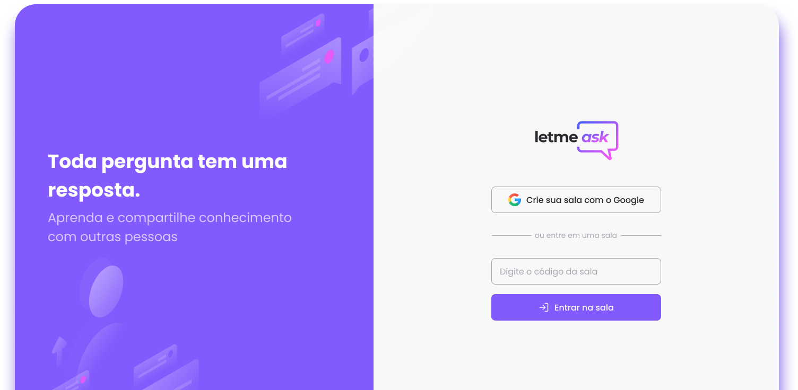

# 
Letmeask

Esta aplicação foi desenvolvida através da maratona NLW da Rocketseat,
utilizando reactJS, além de adquirir uma noção básica do firebase, 
esta aplicação também está hospedada no firebase.

[letmeak.web.app/](https://letmeak.web.app/)

## Iniciando a aplicação

### `npm start or yarn start`

Para iniciar a aplicação na porta 3000, localhost:3000